**Assessment: Use Case Oriented Project**

**Project Overview**

You are tasked with setting up a CI/CD pipeline for a
microservices-based application. The

application will be containerized using Docker and orchestrated using
Kubernetes. Ansible

will be used for configuration management and deployment. The entire
setup should be

managed using Git for version control, and Jenkins will be used to
automate the CI/CD

process.

Assessment Criteria

**1. Git:**

○ Repository setup

○ Branching strategies

○ Commit and merge practices

**2. Docker:**

○ Dockerfile creation

○ Image building and management

○ Containerization of microservices

**3. Kubernetes:**

○ Pod and service creation

○ Deployments and replica sets

○ ConfigMaps and Secrets

**Use Case Scenario:**

Your company is developing a new e-commerce application consisting of
several

microservices: a front-end service, a product catalog service, and an
order processing

service. The goal is to automate the deployment and configuration of
these services across

development, testing, and production environments using Ansible, Docker,
Kubernetes, and

Jenkins.

**Tasks and Deliverables**

**Task 1: Git Repository Setup**

**1. Create a Git repository** to store all project files, including
Ansible playbooks,

Dockerfiles, and Kubernetes manifests.

**1. Initialize a New Git Repository:**

mkdir project-repo

cd project-repo

**2. Initialize a new Git repository:**

git init

**3. Create Directory Structure:**

mkdir dockerfiles kubernetes

**4. Create and Add a .gitignore File:**

echo \"

\# Ignore the following

\*.log

\*.tmp

\*.bak

\*.swp

\" \> .gitignore

### **4. Add Files to the Repository**

touch ansible/playbook.yml dockerfiles/Dockerfile
kubernetes/deployment.yml

Stage the files for commit:

git add .

**Commit the files:**

git commit -m \"Initial commit with project structure and example
files\"

**5. Set Up Remote Repository:**

git remote add origin https://github.com/your-username/project-repo.git

**Push the initial commit to the remote repository:**

git push -u origin master

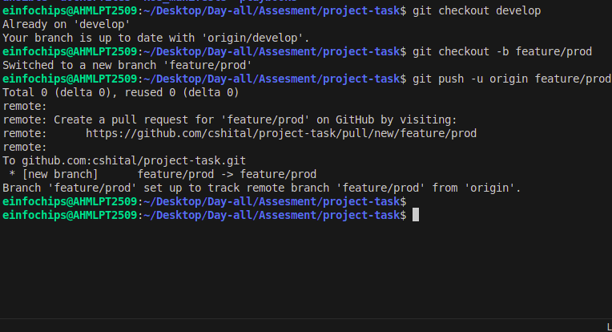

**2. Branching Strategy:**

○ Create branches for development, testing, and production.

○ Implement a strategy for merging changes from development to testing
and

Production.

**1. Create Branches:**

git checkout -b development

git push -u origin development

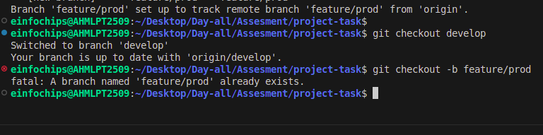


**Create a testing branch:**

git checkout -b testing

git push -u origin testing

**Create a production branch:**

git checkout -b production

git push -u origin production

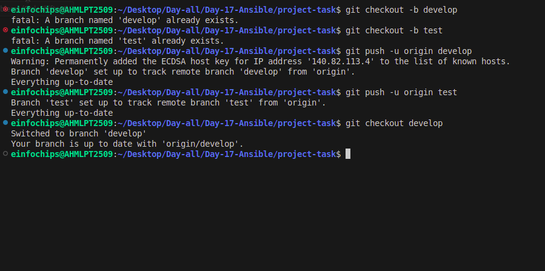

**2. Merging Strategy:**

**Development Branch:**

git checkout -b feature/your-feature development

\# After completing the feature

git checkout development

git merge feature/your-feature

git push origin development


height="1.6145833333333333in"}

**Testing Branch:**

git checkout testing

git merge development

git push origin testing

**Production Branch:**

git checkout production

git merge testing

git push origin production

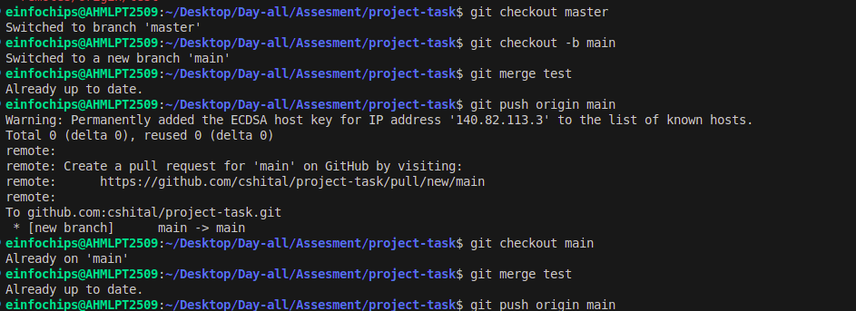

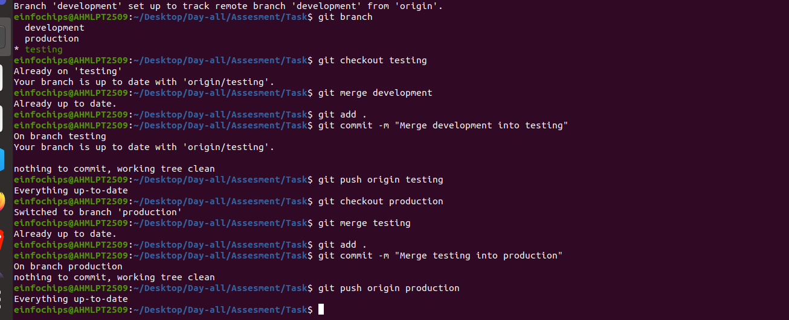

**Task 2: Dockerize Microservices**

**1. Create Dockerfiles** for each microservice (front-end, product
catalog, order

processing).

#### **1. Create Dockerfiles for Each Microservice:**

Let\'s create Dockerfiles for the three microservices: front-end,
product catalog, and order processing. Place these Dockerfiles in the
dockerfiles directory you created earlier.

**Dockerfile for Front-End Microservice:**

\# Use the official Nginx base image

FROM nginx:latest

\# Copy the custom HTML file to the appropriate location

COPY index.html /usr/share/nginx/html/

\# Expose port 80

EXPOSE 80

**Index.html:**

\<!DOCTYPE html\>

\<html\>

\<head\>

\<title\>frontend\</title\>

\</head\>

\<body\>

\<h1\>frontend\</h1\>

\<p\> \"Hello, Docker\" \</p\>

\<button\>Docker\</button\>

\</body\>

\</html\>

**Dockerfile for Product Catalog Microservice:**

\# Use the official Nginx base image

FROM nginx:latest

\# Copy the custom HTML file to the appropriate location

COPY index.html /usr/share/nginx/html/

\# Expose port 80

EXPOSE 80

**Index.html:**

\<!DOCTYPE html\>

\<html\>

\<head\>

\<title\>prodcatalog\</title\>

\</head\>

\<body\>

\<h1\>prod catalog\</h1\>

\<p\> \"Hello, Terraform\" \</p\>

\<button\>Terraform\</button\>

\</body\>

\</html\>

**Dockerfile for Order Processing Microservice:**

\# Use the official Nginx base image

FROM nginx:latest

\# Copy the custom HTML file to the appropriate location

COPY index.html /usr/share/nginx/html/

\# Expose port 80

EXPOSE 80

**Index.html:**

\<!DOCTYPE html\>

\<html\>

\<head\>

\<title\>orderprocessing\</title\>

\</head\>

\<body\>

\<h1\>orderprocess\</h1\>

\<p\> \"Hello, kubernetes\" \</p\>

\<button\>Kubernetes\</button\>

\</body\>

\</html\>

**2. Build Docker images** for each microservice and push them to a
container registry

(e.g., Docker Hub).

#### **2. Build Docker Images for Each Microservice:**

Front-End Microservice:

cd front-end/

docker build -t my-frontend:latest .

docker images

docker tag my-frontend:latest shital37/my-frontend:latest

docker push shital37/my-frontend:latest

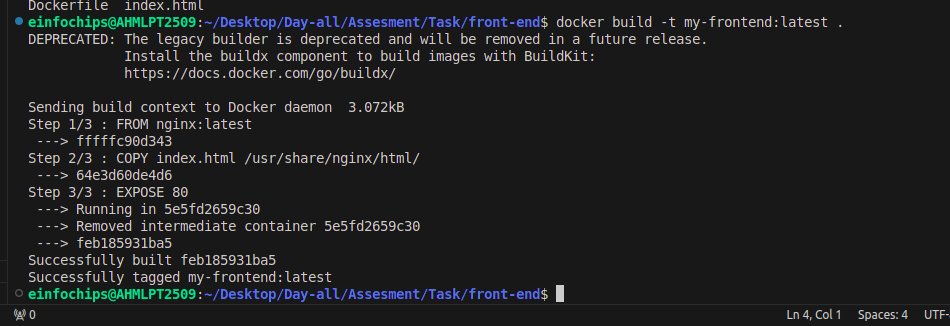

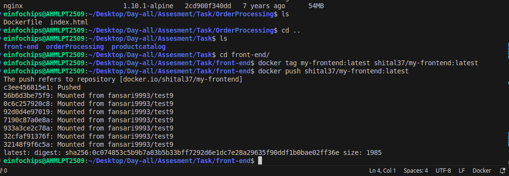
Product Catalog Microservice:

cd product

docker build -t my-product-catalog:latest .

docker images

docker tag my-product-catalog:latest shital37/my-product-catalog:latest

docker push shital37/my-product-catalog:latest

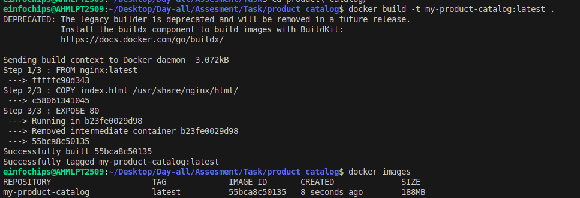

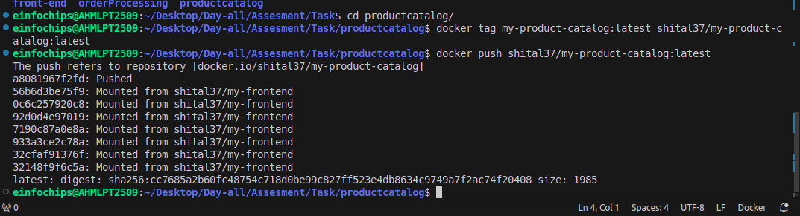

Order Processing Microservice:

cd OrderProcessing

ls

docker build -t my-order-processing:latest .

docker images

docker tag my-order-processing:latest
shital37/my-order-processing:latest

docker push shital37/my-order-processing:latest

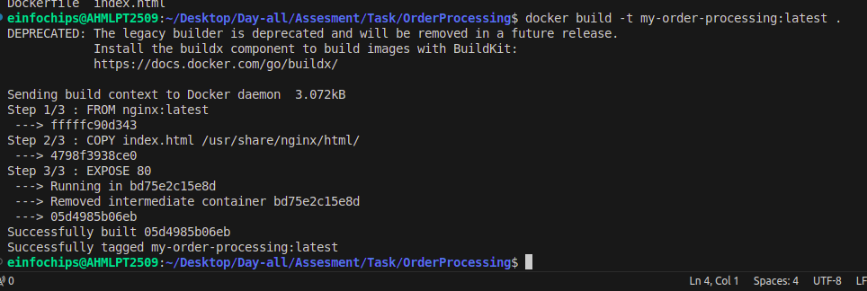

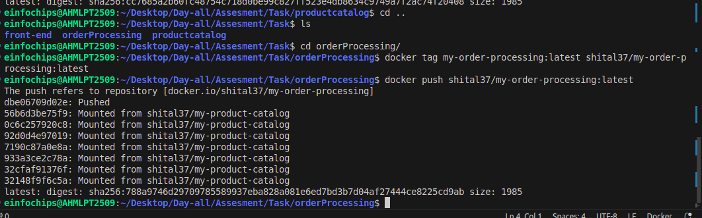


docker images

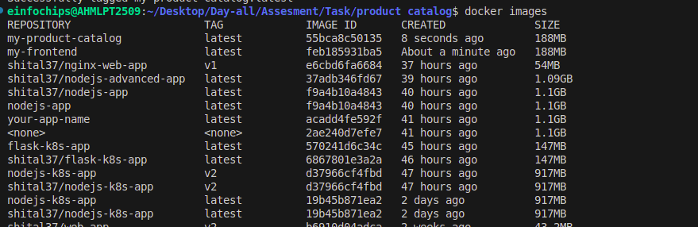

**3. Deliverables:**

○ Dockerfiles for each microservice

○ Built Docker images in a container registry

### **Summary of Deliverables:**

#### **Dockerfiles for Each Microservice:**

-   dockerfiles/Dockerfilesfront-end

-   dockerfiles/Dockerfile-product-catalog

-   dockerfiles/Dockerfile-order-processing

#### **Built Docker Images in a Container Registry:**

-   shital37/my-frontend:latest

-   shital37/my-product-catalog:latest

-   shital37/my-order-processing:latest

```{=html}
<!-- -->
```
-   These steps will create Dockerfiles for each microservice, build
    Docker images from these Dockerfiles, and push the images to Docker
    Hub.

**Task 3: Kubernetes Deployment**

**1. Create Kubernetes manifests for deploying each microservice.**

○ Define Pods, Services, Deployments, and ReplicaSets.

○ Use ConfigMaps and Secrets for configuration management.

#### **1. Create Kubernetes Manifests for Each Microservice:**

Let\'s create Kubernetes manifests for the three microservices:
front-end, product catalog, and order processing. Place these manifests
in the kubernetes directory.

##### **Front-End Microservice:**

**Deployment (kubernetes/front-end-deployment.yaml):**

apiVersion: apps/v1

kind: Deployment

metadata:

name: frontend-deployment

spec:

replicas: 2

selector:

matchLabels:

app: frontend

template:

metadata:

labels:

app: frontend

spec:

containers:

\- name: frontend

image: shital37/my-frontend:latest

ports:

\- containerPort: 80

**Service (kubernetes/front-end-service.yaml):**

apiVersion: v1

kind: Service

metadata:

name: frontend-service

spec:

selector:

app: frontend

ports:

\- protocol: TCP

port: 80

targetPort: 80

nodePort: 30001

type: NodePort

**ConfigMap (kubernetes/front-end-configmap.yaml):**

apiVersion: v1

kind: ConfigMap

metadata:

name: frontend-config

data:

APP_ENV: \"production\"

##### **Product Catalog Microservice:**

Deployment (kubernetes/product-catalog-deployment.yaml):

apiVersion: apps/v1

kind: Deployment

metadata:

name: product-catalog-deployment

spec:

replicas: 2

selector:

matchLabels:

app: product-catalog

template:

metadata:

labels:

app: product-catalog

spec:

containers:

\- name: product-catalog

image: shital37/my-product-catalog:latest

ports:

\- containerPort: 80

Service (kubernetes/product-catalog-service.yaml):

apiVersion: v1

kind: Service

metadata:

name: product-catalog-service

spec:

selector:

app: product-catalog

ports:

\- protocol: TCP

port: 80

targetPort: 80

nodePort: 30002

type: NodePort

ConfigMap (kubernetes/product-catalog-configmap.yaml):

apiVersion: v1

kind: ConfigMap

metadata:

name: product-catalog-config

data:

CATALOG_ENV: \"production\"

Order Processing Microservice:

Deployment (kubernetes/order-processing-deployment.yaml):

apiVersion: apps/v1

kind: Deployment

metadata:

name: order-processing-deployment

spec:

replicas: 2

selector:

matchLabels:

app: order-processing

template:

metadata:

labels:

app: order-processing

spec:

containers:

\- name: order-processing

image: shital37/my-order-processing:latest

ports:

\- containerPort: 80

Service (kubernetes/order-processing-service.yaml):

apiVersion: v1

kind: Service

metadata:

name: order-processing-service

spec:

selector:

app: order-processing

ports:

\- protocol: TCP

port: 80

targetPort: 80

nodePort: 30003

type: NodePort

ConfigMap (kubernetes/order-processing-configmap.yaml):

apiVersion: v1

kind: ConfigMap

metadata:

name: order-processing-config

data:

PROCESSING_ENV: \"production\"

**2. Deploy the microservices to a Kubernetes cluster.**

Make sure your Kubernetes cluster is up and running. If you are using
Minikube, you can start it with:

minikube start

**Apply the manifests to deploy the microservices:**

kubectl apply -f kubernetes/front-end-configmap.yaml

kubectl apply -f kubernetes/front-end-deployment.yaml

kubectl apply -f kubernetes/front-end-service.yaml

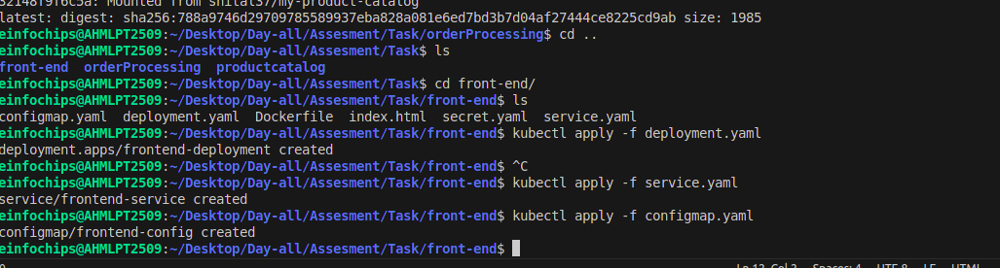
height="1.7395833333333333in"}

kubectl apply -f kubernetes/product-catalog-configmap.yaml

kubectl apply -f kubernetes/product-catalog-deployment.yaml

kubectl apply -f kubernetes/product-catalog-service.yaml

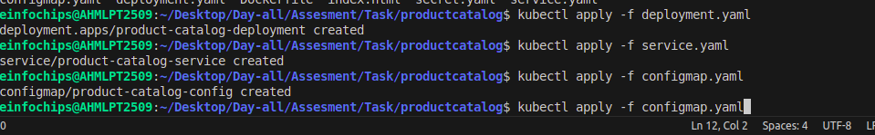{width="6.5in"
height="1.0in"}

kubectl apply -f kubernetes/order-processing-configmap.yaml

kubectl apply -f kubernetes/order-processing-deployment.yaml

kubectl apply -f kubernetes/order-processing-service.yaml

Kubecrl get all

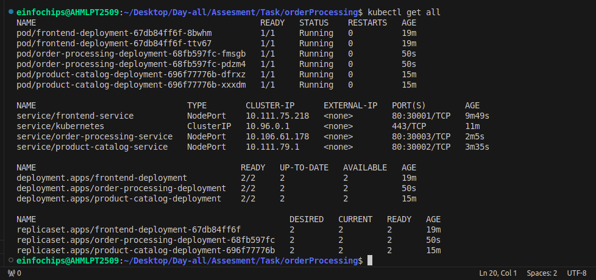{width="6.5in"
height="3.0520833333333335in"}

**3. Deliverables:**

**Kubernetes manifests (YAML files):**

-   kubernetes/front-end-configmap.yaml

-   kubernetes/front-end-secret.yaml

-   kubernetes/front-end-deployment.yaml

-   kubernetes/front-end-service.yaml

-   kubernetes/product-catalog-configmap.yaml

-   kubernetes/product-catalog-secret.yaml

-   kubernetes/product-catalog-deployment.yaml

-   kubernetes/product-catalog-service.yaml

-   kubernetes/order-processing-configmap.yaml

-   kubernetes/order-processing-secret.yaml

-   kubernetes/order-processing-deployment.yaml

-   kubernetes/order-processing-service.yaml

```{=html}
<!-- -->
```
-   **Successful deployment of microservices in the Kubernetes
    cluster.**

These steps will create Kubernetes manifests for each microservice,
including Pods, Services, Deployments, ReplicaSets, ConfigMaps, and
Secrets, and deploy them to your Kubernetes cluster.

### **Using Minikube:**

If you\'re using Minikube, you can access the service using Minikube\'s
IP and the service\'s NodePort.

**Get the Minikube IP:**

minikube ip

**Get the NodePort of the front-end service:**

kubectl get svc front-end-service

**Access the service:**

Open your web browser and go to \>.

**\# access front-end-service:**

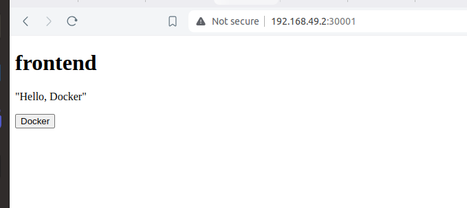
**\# access orderprocesses:**

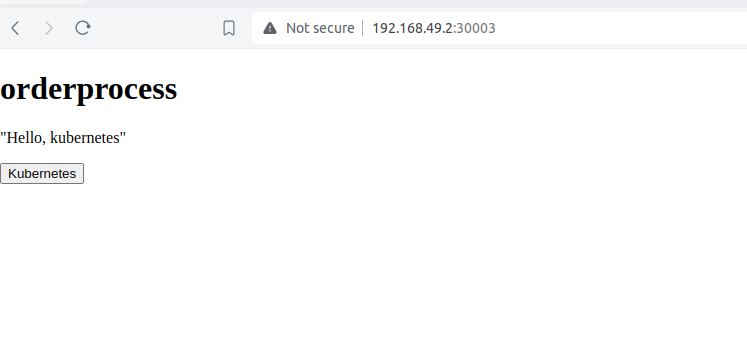

**\# access prod-catalog:**

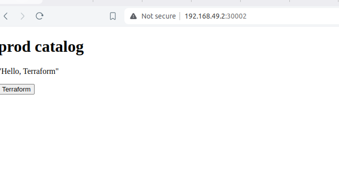
